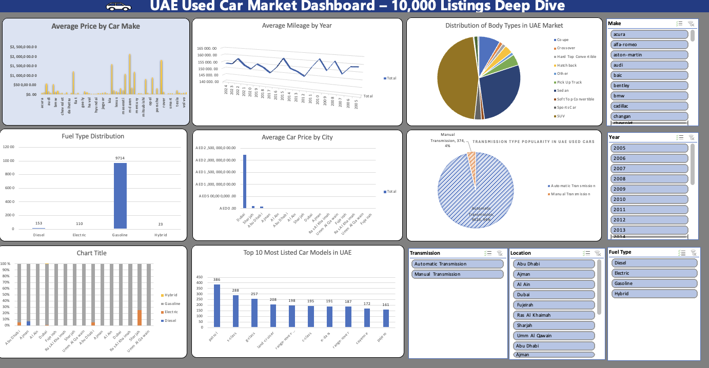

# EV Sales Data Analysis Dashboard (Excel)

Interactive Excel dashboard built to analyze Electric Vehicle (EV) sales data and uncover market trends using data visualization and KPI metrics.

# Project Overview

This project focuses on exploring EV sales patterns using Excel-based analytics. The dashboard provides business insights through visual storytelling and supports data-driven decision making.

# Key Features

- Interactive Pivot Tables and Slicers  
- KPI Scorecards for performance tracking  
- Dynamic Charts for trend analysis  
- Clean dashboard layout for easy interpretation  

# Tools & Technologies

- Microsoft Excel  
- Data Cleaning & Preparation  
- Dashboard Design  
- Data Visualization  

# Preview

## Business Insights

- Identified regional EV adoption trends  
- Highlighted top-performing vehicle models  
- Observed yearly sales growth patterns  
- Supported strategic decisions using visual KPIs  

## Author

Sakshi Arora  
LinkedIn: (https://www.linkedin.com/posts/sakshi-arora-b465aa2a1_exceldashboard-dataanalytics-datavisualization-activity-7323099236948942848-dix_?utm_source=share&utm_medium=member_desktop&rcm=ACoAAEjhf-YBOPhGUTGIYqDyOkUkwDfr_gWBrHg)
